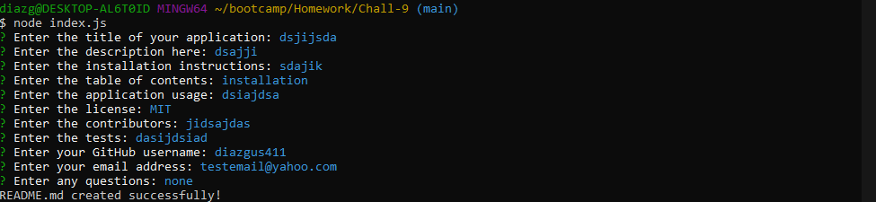

# Challenge 9

## Description

In this applications, user's can use their command prompt line (GitBash for this example) to create themselves a professtional 'README' file for their projects they are creating.

## Table of Contents

- [Description](#description)
- [installation](#installation)
- [Usage](#usage)
- [License](#license)
- [Usage](#contributing)
- [Usage](#tests)
- [Usage](#questions)

## Installation

Sadly their is no way to install this product as of right now as you need my personal computer to be able to run this code and us the command prompt.

## Usage

The usage for this was mentioned before in the [description](#description), but there is more to it. With this application it is much easier to create README files in projects and allows you to skip the hassle of creating the file, and formatting everything that needs to be done. With this application you can just simply enter in some data, and boom you are all set for you README!

## License

MIT

## Contributing

<li>Gustavo Diaz

## Tests

## Questions
For more information or if you are curious to view the source code, visit my GitHub profile: [diazgus411](https://github.com/diazgus411)

To contact me, send an email to: "diazgus411@gmail.com"
